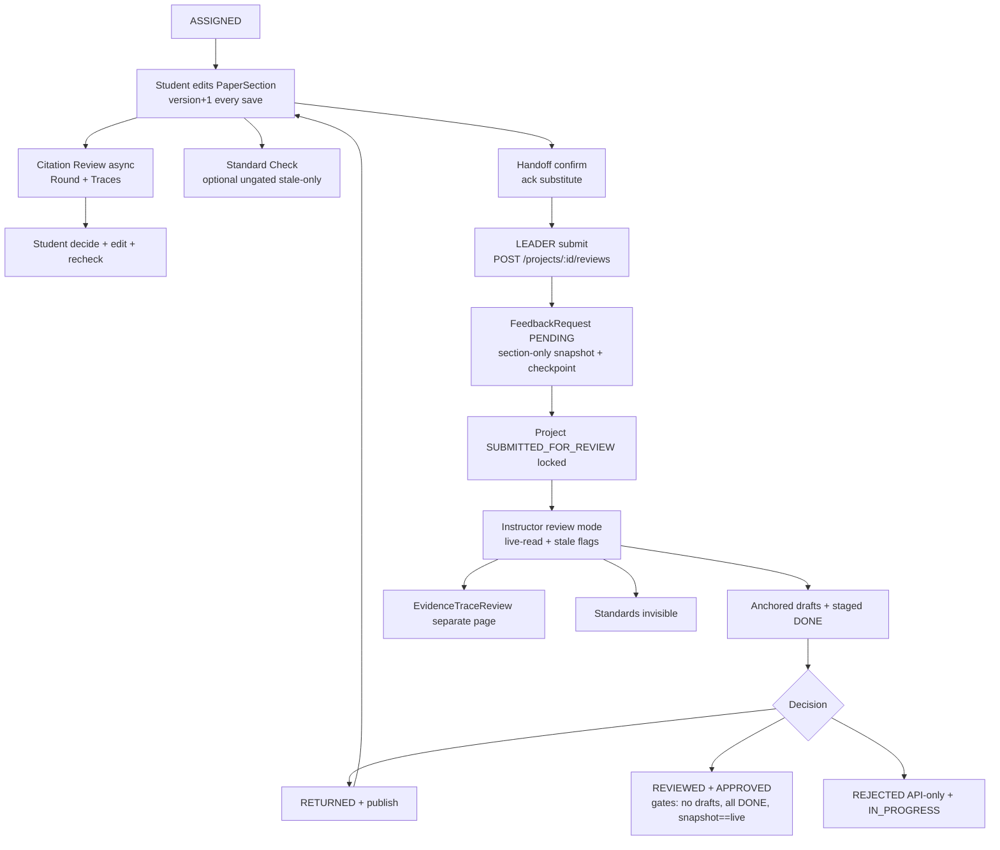
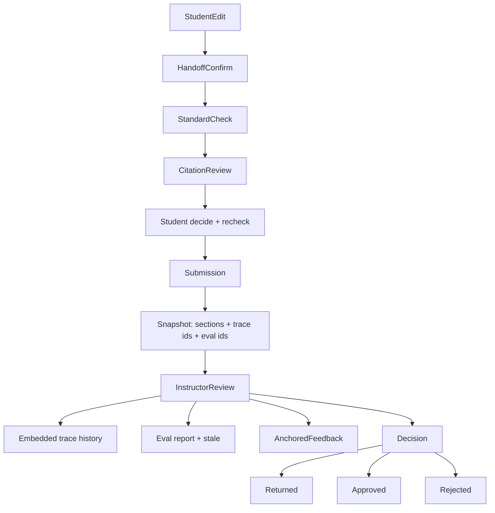

# Evidence Pilot — Instructor Submission Review Audit

## 1. Executive Verdict

The submission→review spine **exists and is coherent**, but the Instructor cannot reliably answer the primary question from one place. **Snapshot + rounds + anchored feedback + evidence-trace lifecycle are CONFIRMED in backend; the review UI fragments them.** Critical gaps: (a) submission snapshot freezes **sections only — no citations/traces/standard verdicts**; (b) **no student acknowledgement entity** (handoff-confirm is the substitute); (c) **standard evaluations are invisible in review UI** and **never gate submit or approve**; (d) **no section-level review state**; (e) **comment replies table exists but is unwired**; (f) instructor extra AI check would **contaminate student history**. Verdict: **PARTIAL — exact submitted text + full finding history + judgments are retrievable via APIs, but the Instructor UI forces mental reconstruction across Review/History/checkpoint-diff/EvidenceTraceReview screens.**

## 2. Current Submission Workflow

```text
Project ASSIGNED
  ↓ Student opens WorkspaceLayout (student mode)
  ↓ Edits PaperSection → PUT /api/papers/:p/sections/:s {content,expectedRevision}
  → PaperProcessingServiceImpl.persistContentRevision: previousContentTex=old, version+1,
    clearHandoff, stampStaleOnContentChanged, markSectionStandardStale
  ↓ Student confirms handoff → handoff endpoint → SubmissionReadinessService.confirm
  ↓ (Optional, ungated) Standard Check → SectionStandardController → SectionStandardService.evaluate
  ↓ (Optional, ungated) Citation Review → POST .../review/source-matches → AiEvaluationJob
    → ai.evaluation.queue → SectionCitationReviewService → CitationReviewRound + EvidenceRevisionTraces
  ↓ Student decides traces (PATCH traces/:id) + edits + AI recheck
  ↓ LEADER submits → POST /api/projects/:id/reviews {expectedSubmissionFingerprint}
  → FeedbackController.submitForReview → FeedbackServiceImpl.submitForReview
  → SubmissionReadinessService.requireReadyForSubmit (LEADER-only, 9 checks, fingerprint match,
    no PENDING request, resubmit must be CHANGED)
  → INSERT FeedbackRequest(PENDING, submissionSnapshotJson) + Project SUBMITTED_FOR_REVIEW
    + CheckpointService.capture(SUBMIT_FOR_REVIEW) + notify REVIEW_SUBMITTED
  ↓ Instructor opens ReviewRequests (GET /api/feedback-requests) → WorkspaceLayout workspaceMode=review
  ↓ Instructor comments (POST /feedback-requests/:id/feedback, drafts) → staged states
  ↓ Instructor decision: PATCH /feedback-requests/:id/status?status=RETURNED|REVIEWED|REJECTED
    → FeedbackRequest.status + Project.status + checkpoint + notifications
```

Evidence: `BE/.../controller/FeedbackController.java:55-71,92-167`; `service/impl/FeedbackServiceImpl.java:98-135,139-341`; `service/SubmissionReadinessService.java:128-165,157-365,367-412`; `service/impl/PaperProcessingServiceImpl.java:666-697`; `service/impl/CheckpointServiceImpl.java:47-84`.

## 3. Current Review Aggregate

**No single clean aggregate — the working aggregate is `FeedbackRequest (latest) + Project`, with `ProjectCheckpoint` and `submissionSnapshotJson` as supporting snapshots.** `FeedbackRequest` represents "this submission being reviewed" (one row per round, latest-wins via `requireLatestRequest`, `FeedbackServiceImpl:414-419`). `Project.status` is the operational lock. `ProjectCheckpoint.snapshotJson` is a lightweight word-count/feedback-count capture, **not** authoritative section text (that lives in `submissionSnapshotJson`). `ReviewSnapshot` is unrelated (AI critique cache). `AiEvaluationJob` is transport state; `CitationReviewRound` is AI-run history; `EvidenceRevisionTrace` is finding state.

## 4. Version & Submission Snapshot Audit

### 4.1 PaperSection Versioning

- `version:Integer` — **every content save** (`persistContentRevision +1`). CONFIRMED.
- `optVersion:Long @Version` — optimistic-lock counter, exposed as `expectedRevision`. CONFIRMED.
- `previousContentTex` — **single-slot undo** (last content only). PARTIAL.
- `handoffConfirmedBy/At/ContentVersion/InputFingerprint` — confirmation of a specific version + fingerprint by assignee. CONFIRMED as acknowledgement-substitute.
- Evidence: `model/PaperSection.java:50-83`; `SubmissionReadinessService.java:73-106,244-257,426-430`; `SectionStandardService.java:85-92`.

### 4.2 Submission Snapshot

`FeedbackServiceImpl.submitForReview:122-123` writes only `submissionSnapshotJson` via `snapshot:367-412`: `{schemaVersion:1, projectId, submittedAt, fingerprint, submittedBy, instructor, papers[{id,title,processingStatus}], sections[{id,title,order,contentTex,contentVersion,assignedUser,handoffState/confirmedBy/confirmedAt/confirmedContentVersion}]}`. **NOT captured: citations, evidence traces, standard-eval results.** `sectionValidation`/`standardSnapshotJson` columns exist but **nothing writes them** — PRESENT BUT UNUSED. Status: PARTIAL. Evidence: `model/FeedbackRequest.java:50,56,59`.

### 4.3 Review Rounds

Each submit inserts a new `FeedbackRequest`; `existsByProjectIdAndStatus(PENDING)` blocks concurrent submits; only latest can transition. Resubmit must differ (`FIRST_SUBMISSION/CHANGED/UNCHANGED/UNVERIFIABLE`). Status: CONFIRMED. Evidence: `repository/FeedbackRequestRepository.java:19,46`; `FeedbackServiceImpl:414-419`; `SubmissionReadinessService:315-365`.

### 4.4 Previous Submission

Prior rounds retrievable (request switcher desc; `GET /feedback-requests` history; `GET /feedback-requests/:id/submission-snapshot` → AVAILABLE/LEGACY_NO_SNAPSHOT; per-section baseline via `GET .../checkpoints/latest/sections/:sid?before=requestedAt`). Status: PARTIAL (scattered across 3 endpoints, no unified compare). Evidence: `controller/CheckpointController.java:36-64`; `service/impl/CheckpointServiceImpl.java:87-150`.

### 4.5 Diff Capability

Backend: `GET .../checkpoints/diff` (wordCountDelta + feedbackResolvedDelta) + baseline text. Frontend: `showChanges` naive whole-block `[-1,+1]` diff (`InstructorFeedbackPanel.jsx:250-283`). No side-by-side submitted-V1-vs-V2 diff. Status: PARTIAL.

```text
VERSION AUDIT
Baseline version: PARTIAL — per-section baseline text before submission; no explicit baseline marker.
Current submitted version: PARTIAL — frozen contentTex+version in snapshot + endpoint; review reads live + stale flags.
Previous submission: PARTIAL — prior requests + snapshots preserved; no unified compare.
Multiple review rounds: CONFIRMED — one FeedbackRequest per submit, latest-wins, resubmit-must-change.
Diff capability: PARTIAL — word-count deltas + naive block diff; no true submitted diff.
Main limitation: snapshot covers sections only; review reads live content; diff is coarse.
```

## 5. Citation / Evidence Review Audit

### 5.1 AI Review Lifecycle

CONFIRMED: `POST /api/papers/:p/sections/:s/review/source-matches` → `submitSectionCitationReview` (dedupe) → `AiEvaluationJob` → `ai.evaluation.queue` → `SectionCitationReviewService.run` (Qdrant topK 20→3 + generate + pacer) → `EvidenceTraceService.materialize` (round + traces) → student `decide` → edit stamps STALE → `recheck` → instructor `review`. Evidence: `controller/PaperController.java:469-515`; `service/impl/AiEvaluationServiceImpl.java:81-109`; `service/impl/EvidenceTraceService.java:64-308`.

### 5.2 Finding State Model

`CitationReviewRound`: id/project/section/sectionVersion/requestedBy/fingerprints/style/generation_meta/summary/complete/createdAt. `EvidenceRevisionTrace`: before (`finding_index` UQ per round, suggested_action, criticality, parent_header, excerpt+offsets, rationale, confidence, source/chunk, evidence_quote/relation); student-after (`student_action` 7 values, explanation, after_passage ≤1200ch, after_fingerprint/version, source_replaced, outcome RESOLVED|PARTIALLY_RESOLVED|UNRESOLVED|STALE); instructor/recheck (judgment EFFECTIVE|PARTIAL|INEFFECTIVE + judged_at; linked_round/mode; ai_recheck_*). No `before_passage` column — before = excerpt + round fingerprints. CONFIRMED. Evidence: `model/EvidenceRevisionTrace.java`; `migration V5/V6/V12`; `dto/response/EvidenceTraceResponse.java:11-46`.

| Field | Meaning | Persisted? | Student sees? | Instructor sees? |
|---|---|---|---|---|
| finding_index | finding # within round | ✅ | ✅ | ✅ (evidence page) |
| suggested_action | ADD_CITATION / QUALIFY | ✅ | ✅ | ✅ |
| excerpt + offsets | before passage | ✅ | ✅ | ✅ |
| rationale / confidence | why + score | ✅ | ✅ | ✅ |
| source/chunk/evidence_quote/relation | supporting evidence | ✅ | ✅ | ✅ |
| student_action (7) | ADD_CITATION…DISMISS_WITH_REASON | ✅ | ✅ | ✅ |
| after_passage/version/fingerprint | revised text | ✅ | ✅ | ✅ |
| outcome | RESOLVED/PARTIAL/UNRESOLVED/STALE | ✅ | ✅ | ✅ |
| ai_recheck_* | EFFECTIVE/PARTIAL/INEFFECTIVE + reason | ✅ | ✅ | ✅ |
| judgment + instructor_feedback | instructor verdict | ✅ | ✅ | ✅ |
| content fingerprints | round + section fingerprints | ✅ | — | ✅ (409 logic) |

### 5.3 Student Decisions

`decide` — 409 if judged; 409 SECTION_NOT_CHANGED unless DISMISS_WITH_REASON or edited; outcome = STALE if edited else UNRESOLVED (never RESOLVED here). `stampStaleOnContentChanged` on every save nulls after-passage for unjudged traces.

```text
AI finding #7 → Generated (outcome NULL, "unaddressed")
  → dismissed: studentAction=DISMISS_WITH_REASON + explanation, outcome UNRESOLVED/STALE
  → acted: studentAction + after_passage/version, outcome UNRESOLVED (→ recheck)
  → resolved: ONLY via instructor EFFECTIVE→RESOLVED (PARTIAL→PARTIALLY_RESOLVED, INEFFECTIVE→UNRESOLVED)
  → ignored: no code concept ≈ outcome NULL or STALE-after-edit
```

"18 findings, 3 used": all 18 persist; 3 have studentAction+after_passage; 15 remain NULL/UNRESOLVED/STALE — distinguishable. CONFIRMED.

### 5.4 Instructor Visibility

Backend exposes all fields; dedicated `EvidenceTraceReview.jsx` matrix page exists — but main section review panel has **no findings tab** (`onRunCitationReview=undefined`). Status: PARTIAL.

| Citation-review information | Backend | Student UI | Instructor UI |
|---|---|---|---|
| Finding / rationale / confidence | ✅ | ✅ | ✅ separate page |
| Evidence source / quote | ✅ | ✅ | ✅ separate page |
| Student decision / before-after | ✅ | ✅ | ✅ separate page |
| AI recheck / judgment | ✅ | ✅ | ✅ separate page |

### 5.5 Instructor Judgment

`review` EFFECTIVE→RESOLVED etc., instructor-only gate, judged traces lock (`TRACE_ALREADY_JUDGED`) and survive edits. CONFIRMED. Evidence: `EvidenceTraceService.java:291-308`; `CurrentUserServiceImpl:142`.

### 5.6 Additional Instructor AI Review

Technically callable when project writable, but: UI absent; blocked (409) while SUBMITTED; new run verbatim-matches into existing traces (only `requested_by` differs) — **merges/contaminates student history**. No separate namespace. Status: BACKEND ONLY (blocked while submitted); NOT capable of clean separate check.

## 6. Standard Check Audit

### 6.1 Standard Configuration

Requirements per section (`saveConfig`, instructor/admin only, 409 if any section assigned). Prompt from `prompt_templates` (admin) + generation catalog singleton. `Project.targetStandard` is an **unused stub**; `ReviewGuide` feeds suggestions, not CHECK_STANDARD. Standards = section-level requirements + global prompt, fingerprinted not versioned. PARTIAL. Evidence: `SectionStandardService.java:127,272`; `Project.java:40`.

### 6.2 Evaluation

Fields: section/document/project ids, `input_fingerprint` (requirements+version+content), `prompt_fingerprint`, `generation_*`, `pass_threshold` (always null), `requirements_json`, `status` (CONFIGURED|COMPLETED + legacy), `result_json`, `raw_output`, timestamps. Endpoints `GET/POST /api/papers/:d/sections/:s/standard-evaluation[/jobs|/config]`. CONFIRMED.

### 6.3 Staleness

Edit after COMPLETED → STALE: CONFIRMED (write `markSectionStandardStale` + computed stale on mismatch). **But blocks nothing**: submit gate has no standard item; approve checks snapshot-equality + no-drafts + all-DONE only. PASS → edit → submit without rerun is ALLOWED. Status: PRESENT BUT UNUSED as gate.

### 6.4 Student Acknowledgement

**MISSING.** Zero `acknowledg*` hits in main code. Substitute: handoff confirm (assignee + fingerprint match; `SECTION_CONFIRMED` blocks submit) — covers content version/fingerprint/confirmer, but **no evaluation id**, not framed as responsibility-ack. Instructor cannot prove which evaluation was acknowledged.

### 6.5 Instructor Visibility

| Standard information | Backend | Student | Instructor |
|---|---|---|---|
| Overall status / stale | ✅ | ✅ | ❌ (guide checklist only) |
| Detailed report / rules | ✅ | ✅ | ❌ |
| Eval version / timestamp | ✅ | ✅ | ❌ |
| Student acknowledgement | ❌ | ⚠️ confirm btn | ⚠️ handoff chip |

Status: BACKEND ONLY.

### 6.6 Standard Versioning

Old evals retain requirement-embedded `input_fingerprint` + prompt/generation fingerprints (forensically recoverable). Edits blocked while assigned/submitted, so mid-review standard change **cannot currently occur**. No explicit version column. PARTIAL.

## 7. Instructor Feedback Audit

### 7.1 Feedback Model

`InstructorFeedback`: request+section+instructor FKs, `lineReference` (legacy), `sectionVersion` (**submitted version from snapshot**), `anchorJson` (V26) + opt_version, `content`, `publishedAt` (null=draft, published on RETURNED, hidden from students until then), `threadState` OPEN/DONE + two-phase `pendingState`. CONFIRMED. Evidence: `model/InstructorFeedback.java`; `migration V1/V26/V27`; `FeedbackServiceImpl:139-274`.

### 7.2 Anchoring

`FeedbackAnchor{original{representation=latex-source-lf-v1, offsetUnit=utf16, contentVersion, fingerprint=sha256, from,to,exact,prefix[64],suffix[64]}, current{status,version,fingerprint,from,to}}`. Authoritative text = **snapshot contentTex**; `recover()`: fingerprint match → ATTACHED, else unique exact+context → ATTACHED else DETACHED; `remap()` via TextChange list (≤10k ops/5MB guards). Statuses SECTION/UNLOCATED/ATTACHED/MODIFIED/DETACHED; `stale=(anchorV<currentV)`. Char offsets, resilient with explicit degradation. CONFIRMED. Evidence: `dto/response/FeedbackAnchor.java`; `service/FeedbackAnchorService.java:34-264`; `FE/src/utils/student/feedbackAnchors.js`.

### 7.3 Comment Granularity

| Granularity | Model | UI | Persisted |
|---|---|---|---|
| Word/text selection | ✅ | ✅ | ✅ |
| Paragraph | ✅ | ✅ | ✅ |
| Section (no selection) | ✅ | ✅ | ✅ |
| Citation / trace-direct | ❌ (no trace FK) | ❌ | ❌ |
| Project summary | ❌ | ❌ | ❌ |

### 7.4 Threads

Per-comment OPEN/DONE + pending commit: CONFIRMED (single-level). True replies: `feedback_replies` table (V27 + backfill) exists but **no entity/repository/service/controller** — PRESENT BUT UNUSED.

### 7.5 Revision Survival

Remap/recover on edit; quoted original + stale + previousRoundOpen badges; History tab preserves prior rounds. Outcomes ATTACHED/MODIFIED/DETACHED — never silently misattached. CONFIRMED.

## 8. Instructor UI Audit

### 8.1 Current Component Tree

```text
App.jsx /instructor/requests/:projectId → ProtectedRoute(INSTRUCTOR,ADMIN)
  → WorkspaceLayout workspaceMode="review"
    → WorkspaceHeader (history+AI hidden) | FilePanel (read-only)
    → EditorPanel (LatexEditor readOnly + PreviewPane + highlights)
    → ContextPanel [Source|Requirements|Review] (default Review)
       → Source: sources + PaperReferencesPanel(canMutate=false)
       → Requirements: InstructorReviewGuide (guide + local checklist)
       → Review: InstructorFeedbackPanel (request switcher, submitted|working,
                  manual|ai|history, OPEN/DONE filter, showChanges,
                  MarkDone/Reopen, RETURNED/APPROVED modal)
```

### 8.2 Current Layout

```text
┌───────────────┬─────────────────────────┬──────────────────────┐
│ FilePanel     │ EditorPanel             │ ContextPanel=Review  │
│ sections/     │ read-only LaTeX +       │ request switcher     │
│ papers/       │ preview (+highlights)   │ submitted|working    │
│ sources       │                         │ manual|ai|history    │
└───────────────┴─────────────────────────┴──────────────────────┘
```

Select text → draft anchored comment (gated: PENDING + submitted view + snapshot AVAILABLE). REJECTED exists in API only (no UI button).

### 8.3 Available Review Information

Submitted text (snapshot-gated writes, live reads + stale), raw snapshot endpoint, word-delta diff + baseline text, prior rounds/comments, anchored drafts with staleness, handoff chips, AI-suggestion inject tab.

### 8.4 Missing Review Information

Co-located trace history with before/after + judgments; standard-eval report + stale; explicit acknowledgement; section-level progress; true submitted-vs-submitted diff; project summary; threaded replies.

### 8.5 Three-Pane Compatibility

| Proposed UI | Existing source | Ready? | Missing pieces |
|---|---|---|---|
| Sections navigation | FilePanel | ✅ | — |
| Submitted paper | EditorPanel + snapshot endpoint | ⚠️ PARTIAL | default to snapshot text |
| Highlight selection | LatexEditor bridge | ✅ | — |
| Inline comments | InstructorFeedback + anchors | ✅ | trace/project FKs |
| Overview | Request switcher + handoff chips | ⚠️ | aggregated header |
| Evidence tab | EvidenceTraceReview page | ⚠️ | embed per-section |
| Standards tab | SectionStandardEvaluation API | ❌ in UI | report viewer + stale badge |
| Comments tab | Manual tab | ✅ | threads |
| Changes/diff | checkpoint diff | ⚠️ | submitted-vs-submitted diff |

## 9. Section Review Progress

**MISSING.** No per-section NOT_REVIEWED/REVIEWED/NEEDS_REVISION/ACCEPTED state in models, DTOs, or FE state. Only per-comment OPEN/DONE + local unpersisted checklist + request/project status.

## 10. Project Review Decision

`FeedbackRequest.status` (round state) vs `Project.status` (operational lock). Actions via `PATCH /feedback-requests/:id/status?status=`:
- **Return** (UI ✅): PENDING+latest → publish drafts, apply pending → req RETURNED + project RETURNED (editable).
- **Approve/Reviewed** (UI ✅): PENDING|RETURNED+latest, no drafts, snapshot==live, all roots DONE → req REVIEWED + project APPROVED (readonly).
- **Reject** (UI ❌, API only): → req REJECTED + project IN_PROGRESS.
Evidence: `FeedbackController:146-167`; `FeedbackServiceImpl:232-341`; `useInstructorReview.js:385-447`.

## 11. Review Round Historical Integrity

```text
ROUND N: snapshot ✅ sections | traces ✅ append-only (verbatim-matched) |
  standards ⚠️ persist w/ fingerprints, not round-linked, live-readable only |
  acknowledgement ⚠️ handoff frozen in snapshot, no ack row |
  comments ✅ request-scoped, published on RETURNED | decision ✅ status + timestamps
```

Overwritten: `previousContentTex` (single slot), live contentTex, local checklist/AI drafts, pendingState. Rest append-only per round.

## 12. Functional Scenario Results

1. **Edit after PASS → submit**: ALLOWED; eval STALE; gate ignores; review panel shows nothing. GAP.
2. **Dismiss finding → submit**: ALLOWED; DISMISS_WITH_REASON + UNRESOLVED/STALE; visible on evidence page, not section panel. PARTIAL.
3. **Accept + edit + recheck → submit**: full chain (excerpt → action + after_passage → recheck → pending judgment) coherent via trace row. CONFIRMED (backend + separate page).
4. **Return → edit → resubmit → compare**: prior snapshot/comments kept; compare = word deltas + naive diff. PARTIAL.
5. **Standard changed between rounds**: blocked while assigned/submitted (409); old evals fingerprint-identifiable. PARTIAL (safe by blocking).
6. **Anchor after rewrite**: ATTACHED/MODIFIED/DETACHED + stale badge; never misattached. CONFIRMED.
7. **Instructor runs review**: UI absent; API 409 while submitted; would merge into student traces. NOT SUPPORTED cleanly.

## 13. Proposed Principles — Verification Results

1. Submitted paper as primary object — PARTIALLY SUPPORTED
2. Review immutable submitted version — PARTIALLY SUPPORTED
3. Compare current vs previous — PARTIALLY SUPPORTED
4. AI advisory; student/instructor separate — SUPPORTED
5. See history vs rerun — PARTIALLY SUPPORTED
6. Optional extra check w/o corruption — NOT SUPPORTED
7. Standard Check visible — NOT SUPPORTED (review UI)
8. Acknowledgement identifies content/eval — NOT SUPPORTED
9. Historical standards identifiable — PARTIALLY SUPPORTED
10. Feedback anchored to submitted content — SUPPORTED
11. Comment, not direct edit — SUPPORTED
12. Section-by-section progress — NOT SUPPORTED
13. Final decision aggregates context — PARTIALLY SUPPORTED

## 14. Reusable Existing Building Blocks

| Desired capability | Existing mechanism | Reuse | Limitation |
|---|---|---|---|
| Submission snapshot | `FeedbackRequest.submissionSnapshotJson` | High | sections-only; add trace/eval refs |
| Previous version | `previousContentTex` | Low | single slot; use snapshots instead |
| Round baseline | `ProjectCheckpoint` + baseline endpoint | Medium | word-count oriented |
| Review round | `FeedbackRequest` latest-wins | High | sufficient; keep |
| Inline feedback | `anchorJson` + remap | High | sufficient; add trace FK optionally |
| Evidence findings | `EvidenceRevisionTrace` + rounds | High | surface in panel, don't remodel |
| AI run | `CitationReviewRound` + job | High | keep; add instructor namespace if needed |
| Standard check | `SectionStandardEvaluation` + fingerprints | High | build viewer + gates |
| Acknowledgement | handoff confirm | Medium | add explicit ack row w/ eval id |
| Review decision | req+project status + gates | High | add Reject button; keep transitions |

## 15. Functional Gap Matrix

| Capability | Current State | Backend | Frontend | Persistence | Historical/Auditable | Severity |
|---|---|---|---|---|---|---|
| Immutable submitted version | PARTIAL | ✅ snapshot | ⚠️ live-read | ✅ sections | ⚠️ sections-only | HIGH |
| Previous submission | PARTIAL | ✅ | ⚠️ scattered | ✅ | ✅ | MEDIUM |
| Submission diff | PARTIAL | ⚠️ word-delta | ⚠️ naive | ⚠️ | ⚠️ | HIGH |
| Citation finding history | PARTIAL | ✅ | ⚠️ off-panel | ✅ | ✅ | HIGH |
| Student citation decision | PARTIAL | ✅ | ⚠️ off-panel | ✅ | ✅ | HIGH |
| Instructor evidence judgment | CONFIRMED | ✅ | ✅ | ✅ | ✅ | NONE |
| Instructor extra AI check | MISSING | ⚠️ merges | ❌ | ❌ separate | ❌ | MEDIUM |
| Standard report | BACKEND ONLY | ✅ | ❌ | ✅ | ✅ fingerprints | HIGH |
| Standard version history | PARTIAL | ⚠️ fingerprints | ❌ | ⚠️ | ⚠️ | MEDIUM |
| Student acknowledgement | MISSING | ❌ | ⚠️ confirm btn | ⚠️ handoff | ❌ eval link | HIGH |
| Inline comments | CONFIRMED | ✅ | ✅ | ✅ | ✅ | NONE |
| Comment thread | PRESENT BUT UNUSED | ❌ wired | ❌ | ✅ table | — | MEDIUM |
| Section review status | MISSING | ❌ | ❌ | ❌ | ❌ | MEDIUM |
| Review round history | CONFIRMED | ✅ | ✅ | ✅ | ✅ | NONE |
| Project final decision | CONFIRMED | ✅ | ⚠️ no Reject btn | ✅ | ✅ | LOW |

## 16. P0 / P1 / P2 / P3 Recommendations

**P0 (correct semantics):** snapshot-default rendering (Frontend only); standard-report surfacing + stale badge (Frontend only); explicit acknowledgement row with section version + eval id + fingerprint (Backend+DB+API+FE); explicit approve-gate policy for standards/evidence (Backend only).
**P1 (effective review):** evidence tab in section panel (Frontend only); submitted-vs-submitted diff (Frontend + small Backend); citation-level feedback FK (DB+API+FE); instructor-check namespace (Backend+DB); Reject button (Frontend only).
**P2 (UX):** overview/evidence/standards/comments tabs, section progress checklist (mostly Frontend).
**P3:** wire `feedback_replies` (Backend+FE), project summary comment, export-approval linkage.

## 17. Current Workflow Diagram



## 18. Proposed Minimal Workflow Diagram



Minimal deltas: extend snapshot payload (no new aggregate), render snapshot text by default, embed existing trace/standard APIs, add ack row + gate policy, optional trace-FK/namespace.

## 19. Direct Answers to Q1–Q12

- **Q1 exact submitted version? PARTIAL.** Frozen text exists + writes snapshot-gated, but panel renders live + stale flags.
- **Q2 what changed since previous round? PARTIAL.** Prior rounds + baselines + word deltas; no true section diff.
- **Q3 finding→decision→revision→recheck→judgment trace? PARTIAL.** Modeled in one trace row; exposed backend + separate page, not section panel.
- **Q4 18 findings, 3 acted on? PARTIAL.** All 18 persist with states; determinable via evidence page, not inline.
- **Q5 exact Standard Check? PARTIAL.** Eval row exists; review UI shows only checklist.
- **Q6 acknowledged exact version? NO.** No ack entity; handoff covers content only, no eval link.
- **Q7 standards change w/o destroying history? PARTIAL.** Fingerprints recoverable; no versions; safe via 409 blocking.
- **Q8 durable anchored comment? YES.** Snapshot-anchored offsets + fingerprint + context, persisted.
- **Q9 anchor survives revisions? YES.** Remap/recover → ATTACHED/MODIFIED/DETACHED + stale; never misattached.
- **Q10 section-by-section progress? NO.** Only per-comment DONE + local checklist.
- **Q11 UI exposes info without reconstruction? NO.** Fragmented across Review/History/diff/evidence page/missing standards.
- **Q12 three-pane compatible w/o domain redesign? YES.** All panes map to existing mechanisms; needs snapshot-default rendering + embedded viewers + small extensions.

## 20. Relevant Files for Implementation

- Submit/snapshot: `BE/.../controller/FeedbackController.java:55-113,146-167`; `service/impl/FeedbackServiceImpl.java:84-177,232-341,414-541`; `service/SubmissionReadinessService.java:73-412`; `repository/FeedbackRequestRepository.java`.
- Versioning: `model/PaperSection.java:50-83`; `service/impl/PaperProcessingServiceImpl.java:666-697,958-962`; `controller/PaperController.java:112-181,469-515`.
- Checkpoints/diff: `controller/CheckpointController.java:36-64`; `service/impl/CheckpointServiceImpl.java:47-150`; `model/ProjectCheckpoint.java`.
- Traces: `model/EvidenceRevisionTrace.java`; `model/CitationReviewRound.java`; `service/impl/EvidenceTraceService.java`; `service/impl/SectionCitationReviewService.java`; `FE/src/pages/Instructor/EvidenceTraceReview.jsx`.
- Standards: `model/SectionStandardEvaluation.java`; `service/impl/SectionStandardService.java`; `controller/SectionStandardController.java`.
- Feedback: `model/InstructorFeedback.java`; `dto/response/FeedbackAnchor.java`; `service/FeedbackAnchorService.java`; migration `V26/V27`; `FE/src/utils/student/feedbackAnchors.js`.
- Decisions/UI: `model/FeedbackStatus.java`; `model/enums/ProjectStatus.java`; `FE/src/hooks/useInstructorReview.js`; `FE/src/App.jsx:88-93`; `FE/src/pages/Student/WorkspaceLayout.jsx`; `FE/src/pages/Instructor/ReviewRequests.jsx`; `FE/src/components/Instructor/InstructorFeedbackPanel.jsx`.
- Tests: `SubmissionReadinessServiceTest`, `FeedbackRevisionMySqlTest`, `FeedbackPublicationMySqlTest`, `EvidenceTraceServiceTest`, `AiEvaluationServiceImplTest`, `PaperProcessingServiceImplTest`, `FeedbackControllerTest`, `FlywayMigrationMySqlTest`.

*No code modified; READ-ONLY audit. Classification legend: CONFIRMED / PARTIAL / PRESENT BUT UNUSED / UI ONLY / BACKEND ONLY / MISSING / UNKNOWN.*
