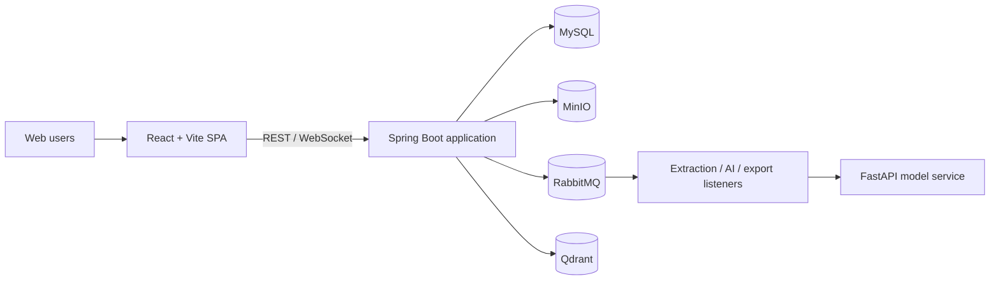

# EvidencePilot

EvidencePilot is an AI-assisted research evidence-traceability platform for
students, instructors, and administrators. It brings collaborative paper
authoring, source management, citation review, instructor feedback, and export
into one project workspace.

## Key capabilities

- Role-based workspaces for Students, Instructors, and Administrators.
- Paper templates, section assignment, editing history, checkpoints, and review.
- PDF, DOCX, and Markdown ingestion, plus DOI lookup through OpenAlex.
- Hybrid evidence search with AI evaluation and explicit human decisions.
- Persistent evidence revision traces: per-finding student decisions, before/after
  passage snapshots, AI recheck, and instructor judgment.
- Instructor feedback, project progress, evidence graphs, traceability, and TeX export.
- Real-time notifications through authenticated STOMP WebSocket connections.

## Architecture



The REST API and RabbitMQ listeners run in the same Spring Boot process. The
stateless Python model service runs separately and provides document extraction,
text generation, and embeddings.

See [System Architecture](System-Architecture.md) for component boundaries,
data ownership, security, deployment, and runtime flows.

## Repositories and components

| Component | Location | Purpose |
| --- | --- | --- |
| Frontend | [`FE`](FE) | React 19, Vite 8, Tailwind CSS 4, REST client, and STOMP client. |
| Backend | [`BE`](BE) | Java 21, Spring Boot 3.3, REST, WebSocket, persistence, queues, and workers. |
| Model service | [adzzse/EvidencePilot_models](https://github.com/adzzse/EvidencePilot_models) | FastAPI, MinerU, generation providers, and Ollama embeddings. |

## Prerequisites

- Git
- Docker Desktop or Docker Engine with Docker Compose
- Node.js and npm
- Maven and Java 21 when running backend tests outside Docker
- The separate model service for extraction and AI features

## Getting started

### 1. Clone the application

```bash
git clone https://github.com/MinhKien17/SEP490_EvidencePilot.git
cd SEP490_EvidencePilot
```

Clone and configure the
[model service](https://github.com/adzzse/EvidencePilot_models) separately. Its
`MODEL_API_KEY` must match the backend's `AI_MODEL_API_KEY`.

### 2. Start the model service

Follow the model repository's README and run FastAPI on port `8000`. For the
local Docker Desktop setup, configure its `.env` with values equivalent to:

```dotenv
MODEL_API_KEY=change-me
EXTRACTION_ALLOWED_HOSTS=127.0.0.1
```

### 3. Start the backend and infrastructure

```bash
cd BE
cp .env.example .env
```

PowerShell equivalent:

```powershell
Copy-Item .env.example .env
```

Fill the blank credentials and secrets in `BE/.env`. For a model service
running on the Windows host through Docker Desktop, use:

```dotenv
APP_BASE_URL=http://127.0.0.1:8080
AI_MODEL_BASE_URL=http://host.docker.internal:8000
AI_MODEL_API_KEY=change-me
```

Then start the Spring Boot application and its local data services:

```bash
docker compose up --build
```

The Compose stack starts the backend, MySQL, MinIO, RabbitMQ, and Qdrant.

### 4. Start the frontend

From the repository root:

```bash
cd FE
npm ci
npm run dev
```

The frontend uses `http://localhost:8080` by default. Set
`VITE_API_BASE_URL` when the backend is hosted elsewhere.

## Local endpoints

| Service | URL |
| --- | --- |
| Frontend | `http://localhost:5173` |
| Backend readiness | `http://localhost:8080/api/health/ready` |
| Swagger UI | `http://localhost:8080/swagger-ui.html` |
| OpenAPI JSON | `http://localhost:8080/v3/api-docs` |
| Model health | `http://127.0.0.1:8000/health` |
| RabbitMQ management | `http://localhost:15672` |
| MinIO console | `http://localhost:9001` |

## Verification

Backend:

```bash
cd BE
mvn test
```

Backend tests are grouped by purpose under `BE/src/test/java`:

```text
mainflow/com/evidencepilot/       # product flows: auth, projects, documents,
                                  # citation review, feedback, export
contract/com/evidencepilot/       # security, API/error, schema/migration,
                                  # async and operational boundaries
infrastructure/com/evidencepilot/ # admin, seed/bootstrap, maintenance,
                                  # configuration-only checks
```

The tier folders are organizational only: Java `package` declarations remain
`com.evidencepilot...`, so Maven/Spring/JUnit discovery and package access stay
unchanged. Keep new tests in the tier that matches the behavior they protect.

Frontend:

```bash
cd FE
npm run build
```

Run the Python tests from the model service repository:

```bash
python -m pytest -q
```

## Main entry points

| Item | Path |
| --- | --- |
| Frontend bootstrap | [`FE/src/main.jsx`](FE/src/main.jsx) |
| Frontend routes | [`FE/src/App.jsx`](FE/src/App.jsx) |
| Backend bootstrap | [`BE/src/main/java/com/evidencepilot/EvidencePilotApplication.java`](BE/src/main/java/com/evidencepilot/EvidencePilotApplication.java) |
| Backend configuration | [`BE/src/main/resources/application.yml`](BE/src/main/resources/application.yml) |
| Local service stack | [`BE/docker-compose.yml`](BE/docker-compose.yml) |
| System architecture | [`System-Architecture.md`](System-Architecture.md) |

The running OpenAPI document is the source of truth for the complete HTTP API.

## Evidence revision trace API

Citation Review findings are persisted as evidence revision traces. Students
record a decision per finding, the editor save captures the revised passage, the
AI verdict is rechecked after edits, and instructors give a final judgment.

| Method | Path | Purpose |
| --- | --- | --- |
| `PATCH` | `/api/papers/{documentId}/sections/{sectionId}/traces/{traceId}` | Student records a decision on a finding (`student_action`, optional source/chunk, `explanation`). `409 SECTION_CONTENT_CHANGED` when the section moved on since the review. |
| `GET` | `/api/projects/{projectId}/evidence-traces` | List traces for a project (instructor matrix), optional `outcome` filter. |
| `PATCH` | `/api/projects/{projectId}/evidence-traces/{traceId}/review` | Instructor judgment (`judgment`, `instructor_feedback`); resolves the trace. |

Trace rows are also included in the traceability export (see
`GET /api/projects/{projectId}/traceability`).
