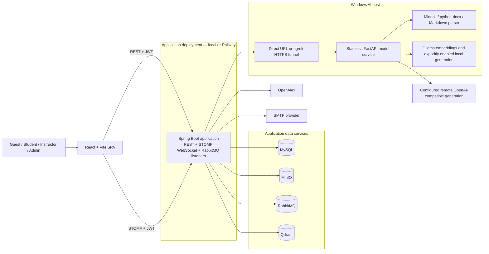
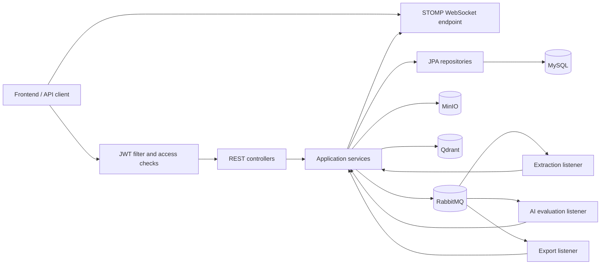
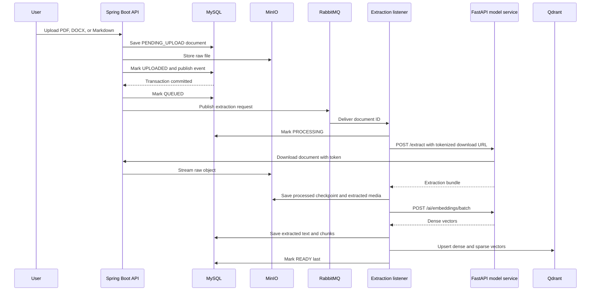
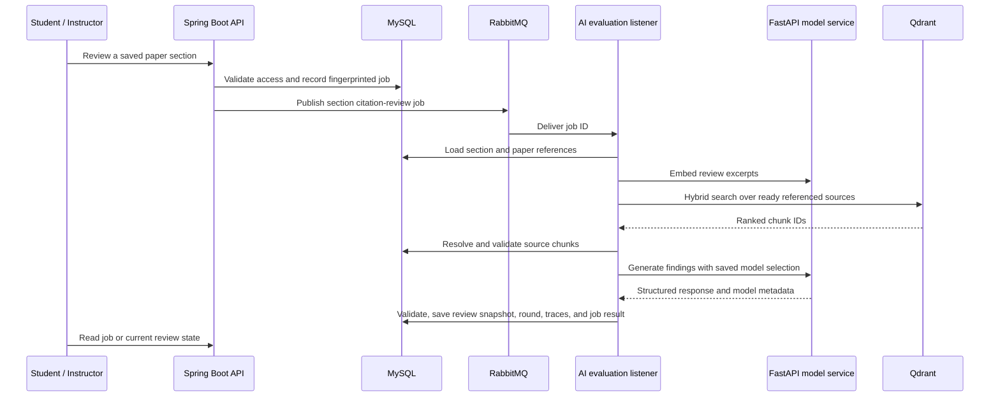
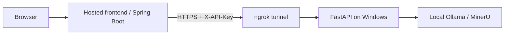

# EvidencePilot System Architecture

This document describes the current runtime architecture of EvidencePilot. It tracks implemented boundaries in the application repository and the separate
[Python model service](https://github.com/adzzse/EvidencePilot_models). The running OpenAPI document remains the source of truth for individual HTTP contracts.

## 1. System context


```mermaid
flowchart LR
    USERS["Guest / Student / Instructor / Admin"] --> FE["React + Vite SPA"]

    subgraph APP["Application deployment — local or Railway"]
        BE["Spring Boot application\nREST + STOMP WebSocket + RabbitMQ listeners"]
    end

    subgraph DATA["Application data services"]
        MYSQL[("MySQL")]
        MINIO[("MinIO")]
        RABBIT[("RabbitMQ")]
        QDRANT[("Qdrant")]
    end

    subgraph AIHOST["Windows AI host"]
        ENTRY["Direct URL or ngrok HTTPS tunnel"]
        MODEL["Stateless FastAPI model service"]
        EXTRACT["MinerU / python-docx / Markdown parser"]
        OLLAMA["Ollama embeddings and explicitly enabled local generation"]
        ENTRY --> MODEL
        MODEL --> EXTRACT
        MODEL --> OLLAMA
    end

    REMOTE["Configured remote OpenAI-compatible generation"]
    OPENALEX["OpenAlex"]
    SMTP["SMTP provider"]

    FE -->|"REST + JWT"| BE
    FE -->|"STOMP + JWT"| BE
    BE --> MYSQL
    BE --> MINIO
    BE --> RABBIT
    BE --> QDRANT
    BE --> ENTRY
    MODEL --> REMOTE
    BE --> OPENALEX
    BE --> SMTP
```

Deployment constraints:

- The frontend and Java application can run locally or on Railway.
- The FastAPI model service runs on the Windows AI host.
- When Java runs remotely, it reaches FastAPI through the existing ngrok tunnel.
- FastAPI is stateless and does not access MySQL, MinIO, RabbitMQ, or Qdrant.
- RabbitMQ listeners are part of the Spring Boot process, not separate deployable services.

## 2. Component responsibilities

| Component | Responsibilities |
| --- | --- |
| React frontend | Public pages, role-gated workspaces, authoring UI, evidence review, administration, REST calls, and WebSocket notifications. |
| Spring Boot application | Authentication, authorization, business rules, persistence, object storage, vector search, integrations, API delivery, background listeners, and scheduled lifecycle/cleanup sweepers. |
| FastAPI model service | Document extraction, generation-provider selection, model catalog discovery, single/batch embeddings, and response normalization. |
| MySQL | Relational source of truth for users, projects, documents, sections, claims, mappings, feedback, jobs, checkpoints, notifications, audit data, evidence revision traces, generation configuration, and deletion state. |
| MinIO | Raw documents, processed extraction checkpoints, project media, and generated export archives. |
| RabbitMQ | Durable queues and dead-letter queues for document extraction, AI evaluation, and export jobs. |
| Qdrant | Dense and sparse vector index for extracted source chunks. |
| OpenAlex | DOI metadata, references, cited-by data, and available Open Access PDFs. |
| SMTP provider | Email verification and password-reset delivery. |

## 3. Backend structure


```mermaid
flowchart LR
    CLIENT["Frontend / API client"] --> SECURITY["JWT filter and access checks"]
    SECURITY --> API["REST controllers"]
    CLIENT --> WS["STOMP WebSocket endpoint"]

    API --> SERVICES["Application services"]
    SERVICES --> REPOS["JPA repositories"]
    REPOS --> MYSQL[("MySQL")]

    SERVICES --> MINIO[("MinIO")]
    SERVICES --> QDRANT[("Qdrant")]
    SERVICES --> RABBIT[("RabbitMQ")]

    RABBIT --> EX["Extraction listener"]
    RABBIT --> AI["AI evaluation listener"]
    RABBIT --> EXPORT["Export listener"]

    EX --> SERVICES
    AI --> SERVICES
    EXPORT --> SERVICES
    SERVICES --> WS
```

Controllers delegate access decisions and business behavior to shared services. The current-user service is the main resource/role authorization boundary. JPA repositories are used behind those checks; client-side route guards are not an authorization substitute.

The three durable work queues are:

| Queue | Consumer | Purpose |
| --- | --- | --- |
| `extraction.queue` | `DocumentExtractionListener` | Extract, chunk, embed, persist, and index a document. |
| `ai.evaluation.queue` | `AiEvaluationListener` | Run section self-checks, citation reviews, source matches, suggestions, and trace rechecks. |
| `export.queue` | `ExportListener` | Build and store an export archive. |

Extraction, AI-evaluation, and export failures use the corresponding `.dlq`
queues after listener retry. Pending extraction and AI-evaluation jobs are
periodically re-enqueued by the Spring Boot schedulers.

## 4. Data ownership

| Store | Authoritative data | Not authoritative for |
| --- | --- | --- |
| MySQL | Business entities, document text/chunk metadata, workflow status, review state, job state, AI generation selection, and project deletion deadlines/tasks. | Raw file bytes and vector similarity index. |
| MinIO | Raw uploads, extraction checkpoints, media, and export files. | Business authorization or document processing status. |
| Qdrant | Search vectors and chunk payload references. | Original text ownership, user access, or workflow status. |
| RabbitMQ | Pending background work delivery and retry dead-letter delivery. | Final job result or long-term audit history. |

The backend validates access against MySQL before serving MinIO content or using Qdrant results. A Qdrant hit is converted back to a MySQL document chunk before it becomes an evidence candidate.

## 5. Core runtime flows

### 5.1 Document ingestion and extraction


```mermaid
sequenceDiagram
    participant User
    participant API as Spring Boot API
    participant DB as MySQL
    participant Store as MinIO
    participant MQ as RabbitMQ
    participant Worker as Extraction listener
    participant Model as FastAPI model service
    participant Vector as Qdrant

    User->>API: Upload PDF, DOCX, or Markdown
    API->>DB: Save PENDING_UPLOAD document
    API->>Store: Store raw file
    API->>DB: Mark UPLOADED and publish event
    DB-->>API: Transaction committed
    API->>DB: Mark QUEUED
    API->>MQ: Publish extraction request
    MQ->>Worker: Deliver document ID
    Worker->>DB: Mark PROCESSING
    Worker->>Model: POST /extract with tokenized download URL
    Model->>API: Download document with token
    API->>Store: Stream raw object
    Model-->>Worker: Extraction bundle
    Worker->>Store: Save processed checkpoint and extracted media
    Worker->>Model: POST /ai/embeddings/batch
    Model-->>Worker: Dense vectors
    Worker->>DB: Save extracted text and chunks
    Worker->>Vector: Upsert dense and sparse vectors
    Worker->>DB: Mark READY last
```

Main status path:

```text
PENDING_UPLOAD -> UPLOADED -> QUEUED -> PROCESSING -> RAW_EXTRACTED -> READY
```

Failures are recorded as `FAILED`. Re-extraction can reuse the processed MinIO checkpoint instead of rerunning extraction when the checkpoint is valid.

The extraction sweeper republishes documents left in `UPLOADED` or `QUEUED`.
Listener retry exhaustion marks the document failed and forwards the message to
`extraction.dlq`.

### 5.2 Section citation review and evidence retrieval


```mermaid
sequenceDiagram
    participant User as Student / Instructor
    participant API as Spring Boot API
    participant DB as MySQL
    participant MQ as RabbitMQ
    participant Worker as AI evaluation listener
    participant Model as FastAPI model service
    participant Vector as Qdrant

    User->>API: Review a saved paper section
    API->>DB: Validate access and record fingerprinted job
    API->>MQ: Publish section citation-review job
    MQ->>Worker: Deliver job ID
    Worker->>DB: Load section and paper references
    Worker->>Model: Embed review excerpts
    Worker->>Vector: Hybrid search over ready referenced sources
    Vector-->>Worker: Ranked chunk IDs
    Worker->>DB: Resolve and validate source chunks
    Worker->>Model: Generate findings with saved model selection
    Model-->>Worker: Structured response and model metadata
    Worker->>DB: Validate, save review snapshot, round, traces, and job result
    User->>API: Read job or current review state
```

`SourceMatchingService` searches only ready sources in the paper's References.
Java converts Qdrant hits back to active MySQL chunks before including them as
evidence. A separate async source-matches request can suggest sources for review
findings; those search candidates are transient. Citation Review findings are
persisted as revision traces, while student decisions and instructor judgments
remain separate actions. The review response can be partial when batches fail;
clients must use its `complete` field rather than job success alone.

#### AI generation selection

The FastAPI service exposes a catalog through `GET /ai/generation-config`. The
backend validates the protocol, allowed models, capability lists, and catalog
fingerprint, then initializes or reads the singleton `ai_generation_config` row.
An Admin can persist one to three allowed model IDs through
`PUT /api/admin/ai/configuration`; the expected revision and catalog fingerprint
make stale updates fail with a conflict. Evaluation and citation-review calls
carry the persisted model chain and fingerprint to `/ai/generate`, while the
backend retains semantic validation and persistence ownership.

### 5.3 Review and feedback

1. An Instructor creates a project, assigns Students, and manages paper structure.
2. Assigned Students edit sections and create claims/evidence decisions.
3. Submitting for review creates a feedback request and project checkpoint.
4. The Instructor reviews sections, evidence, and progress, then returns, reviews, or rejects the request.
5. Returned feedback can be answered by the assigned Student; completed review moves the project into its next lifecycle state.

Project lifecycle values currently include `CREATED`, `ASSIGNED`, `IN_PROGRESS`, `SUBMITTED_FOR_REVIEW`, `RETURNED`, `APPROVED`, `ARCHIVED`, and `PENDING_DELETE` (set when deletion is scheduled; revoke restores the stored pre-deletion status).

#### Project deletion and external cleanup

`DELETE /api/projects/{id}` records the prior lifecycle status, changes the
project to `PENDING_DELETE`, and sets a 30-day retention deadline. During this
window the project is read-only. `PATCH /api/projects/{id}/cancel-deletion`
clears the deadline and restores the recorded status. When the deadline is due,
the hourly `ProjectDeletionSweeper` deletes the project-owned relational rows,
detaches documents shared with another project, and creates idempotent cleanup
tasks for exclusive MinIO objects and Qdrant vectors. Each external cleanup task
runs in its own transaction and retries after a failure; missing objects are
treated as already deleted.

### 5.4 Traceability and export

- Traceability JSON and CSV aggregate claims, sources, suggestions, mappings, references, feedback, evidence revision traces, and gap flags.
- Project graph and progress endpoints derive coverage views from persisted data.
- Async export jobs are queued through `export.queue`, built by the Java worker, stored in MinIO, and downloaded through the authenticated API.
- The current async worker builds TeX/media archives. Traceability data is available through its dedicated JSON and CSV endpoints.

### 5.5 Evidence revision trace

```mermaid
sequenceDiagram
    participant User as Student
    participant API as Spring Boot API
    participant DB as MySQL
    participant MQ as RabbitMQ
    participant Worker as AI evaluation listener
    participant Model as FastAPI model service

    User->>API: Run citation review on a section
    API->>MQ: Queue citation-review job
    MQ->>Worker: Deliver job ID
    Worker->>Model: Generate findings
    Model-->>Worker: Findings list
    Worker->>DB: Persist review round + one trace per finding
    User->>API: PATCH traces/{traceId} (decision, source, explanation)
    API->>DB: Verify content fingerprint; save after-passage + version
    alt Fingerprint mismatch
        API-->>User: 409 SECTION_CONTENT_CHANGED
    end
    User->>API: Save the revised section (PUT section)
    API->>DB: Capture after_passage/version on the section's open traces
    User->>API: Run citation review again (recheck)
    API->>MQ: Queue recheck of stale traces
    Worker->>Model: Re-judge edited passages (EFFECTIVE/PARTIAL/INEFFECTIVE)
    Model-->>Worker: Judgment
    Worker->>DB: Update trace outcome
    Instructor->>API: PATCH evidence-traces/{traceId}/review
    API->>DB: Set judgment + feedback; resolve trace
```

- One `citation_review_rounds` row per review run; one `evidence_revision_traces` row per finding (identity anchored on the trace row, not the finding index).
- Decision PATCH recomputes the section content fingerprint; a mismatch returns `409 SECTION_CONTENT_CHANGED` so the student re-runs review instead of acting on stale findings.
- Re-running review matches findings verbatim to existing traces and rechecks edited (stale) passages through the existing `ai.evaluation.queue` — no new queue or endpoint.

### 5.6 Notifications

Application events persist a `system_notifications` row before notifying the connected user through `/ws`. The frontend also reads the notification inbox and unread count through REST, so reconnecting does not lose persisted events.

## 6. Security and trust boundaries

| Boundary | Control |
| --- | --- |
| Browser to backend | JWT authentication; server-side role and resource-access checks. |
| Browser WebSocket | JWT is validated during STOMP connection setup, including token-version revocation. |
| Backend to model service | Shared `X-API-Key`; all model POST endpoints require it. |
| Model document download | Short tokenized backend URL plus optional model-side hostname allowlist. |
| Backend to object/vector stores | Credentials remain server-side; clients do not receive direct database access. |
| Remote generation provider | Only enabled by explicit provider/key configuration; submitted context leaves the local host. |

Roles are `STUDENT`, `INSTRUCTOR`, and `ADMIN`. Project membership and section assignment further restrict resource access. The backend remains authoritative even when the frontend hides an action by role.

## 7. Deployment topology

### Local development

`BE/docker-compose.yml` starts:

- Spring Boot backend
- MySQL
- Qdrant and collection initialization
- MinIO and bucket initialization
- RabbitMQ with management UI

The React frontend runs separately through Vite. The model service runs outside Compose on the Windows host. With Docker Desktop, the backend reaches it through `host.docker.internal`.

### Remote application with local AI host


```mermaid
flowchart LR
    Browser --> PublicApp["Hosted frontend / Spring Boot"]
    PublicApp -->|"HTTPS + X-API-Key"| Ngrok["ngrok tunnel"]
    Ngrok --> FastAPI["FastAPI on Windows"]
    FastAPI --> Ollama["Local Ollama / MinerU"]
```

Required URL relationship:

- `AI_MODEL_BASE_URL` points to the model service directly or through ngrok.
- `AI_MODEL_API_KEY` matches the model service's `MODEL_API_KEY`.
- `APP_BASE_URL` is a backend URL reachable from the model host.
- `EXTRACTION_ALLOWED_HOSTS` allows the hostname in `APP_BASE_URL`.

The repository currently contains a backend Dockerfile and local Compose stack. Platform deployment settings and secrets are managed outside source control.

## 8. Configuration groups

| Group | Main variables |
| --- | --- |
| Database | `DB_HOST`, `DB_PORT`, `DB_NAME`, `DB_USERNAME`, `DB_PASSWORD` |
| Authentication | `JWT_SECRET`, `JWT_EXPIRATION_MS` |
| Application URL | `APP_BASE_URL` |
| Model service | `AI_MODEL_BASE_URL`, `AI_MODEL_API_KEY`, `AI_MODEL_READ_TIMEOUT_SECONDS`, `AI_MODEL_MAX_RETRIES` |
| AI jobs and throughput | `AI_JOB_SWEEP_INTERVAL_MS`, `AI_JOB_PROCESSING_TTL_SECONDS`, `RABBITMQ_LISTENER_*`, `RABBITMQ_EXTRACTION_MAX_CONCURRENCY`, `RABBITMQ_EVAL_MAX_CONCURRENCY`, `AI_REVIEW_REMOTE_RATE_PER_MINUTE` |
| Python model service | `MODEL_API_KEY`, `EXTRACTION_ALLOWED_HOSTS`, `MINERU_COMMAND`, `MINERU_BACKEND`, `OLLAMA_BASE_URL`, `OLLAMA_EMBEDDING_MODEL` |
| Python generation | `GENERATION_PROVIDER`, `GENERATION_BASE_URL`, `GENERATION_MODEL`, `GENERATION_FALLBACK_MODELS`, `GENERATION_API_KEY` or `GENERATION_API_KEYS` |
| Qdrant | `QDRANT_URL`, `QDRANT_API_KEY` |
| MinIO | `MINIO_URL`, `MINIO_PUBLIC_URL`, `MINIO_ACCESS_KEY`, `MINIO_SECRET_KEY`, `MINIO_BUCKET_NAME` |
| RabbitMQ | `RABBITMQ_HOST`, `RABBITMQ_PORT`, `RABBITMQ_VIRTUAL_HOST`, `RABBITMQ_USERNAME`, `RABBITMQ_PASSWORD` |
| OpenAlex | `OPENALEX_API_BASE_URL`, `OPENALEX_API_KEY`, `OPENALEX_USER_AGENT` |
| Email | `MAIL_HOST`, `MAIL_PORT`, `MAIL_USERNAME`, `MAIL_PASSWORD` |

Never commit populated `.env` files or credentials.

## 9. Public interfaces

| Interface | Location |
| --- | --- |
| Frontend | Vite development server or hosted SPA |
| REST API | `/api/**` |
| WebSocket | `/ws` |
| Swagger UI | `/swagger-ui.html` |
| OpenAPI JSON | `/v3/api-docs` |
| Backend liveness/readiness | `/api/health/live`, `/api/health/ready` |
| Admin AI configuration | `GET/PUT /api/admin/ai/configuration` |
| Project lifecycle | `DELETE /api/projects/{id}`, `PATCH /api/projects/{id}/cancel-deletion`, `PATCH /api/projects/{id}/restore` |
| Model health | `GET /health` |
| Model extraction | `POST /extract` |
| Model generation catalog | `GET /ai/generation-config` |
| Model generation | `POST /ai/generate` |
| Model embeddings | `POST /ai/embeddings`, `POST /ai/embeddings/batch` |

## 10. Technology stack

| Layer | Current stack |
| --- | --- |
| Frontend | React 19, React Router 7, Vite 8, Tailwind CSS 4, Axios, STOMP.js |
| Backend | Java 21, Spring Boot 3.3.5, Spring Web, WebSocket/STOMP, Data JPA, AMQP, Validation |
| Security | JWT, BCrypt, backend role/resource checks |
| Data | MySQL 8, MinIO, RabbitMQ 3.13, Qdrant |
| Model service | Python, FastAPI, MinerU, python-docx, Ollama, optional remote generation providers |
| Build and test | Maven, npm, Docker Compose, pytest |
